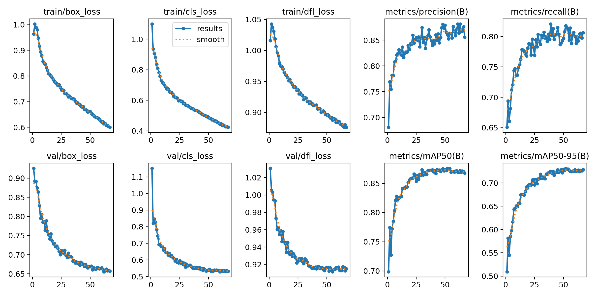
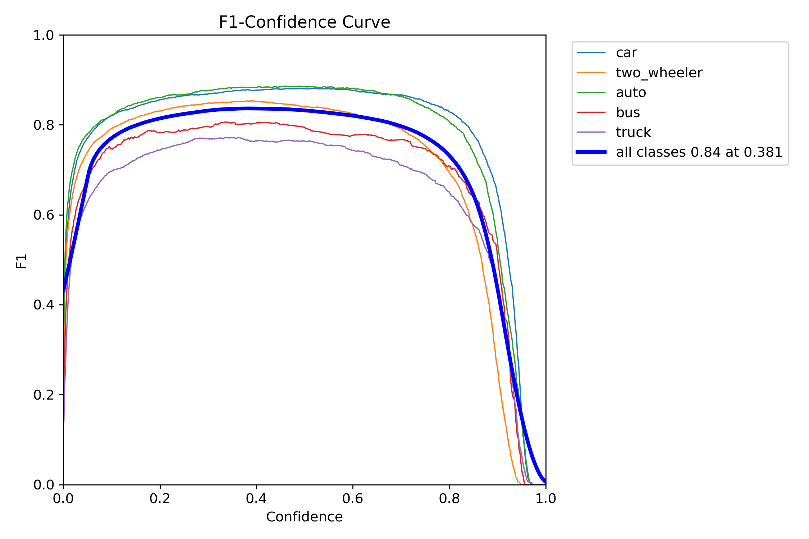
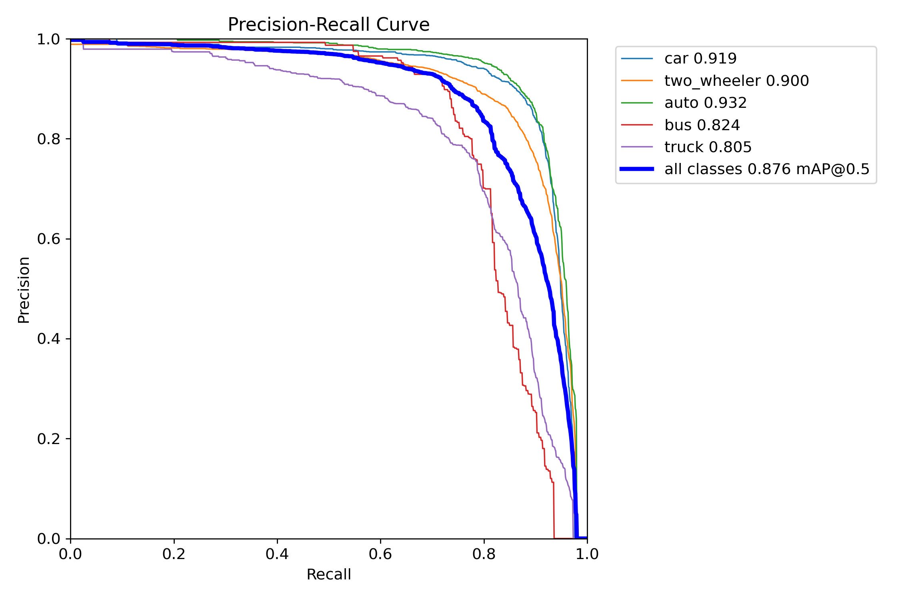
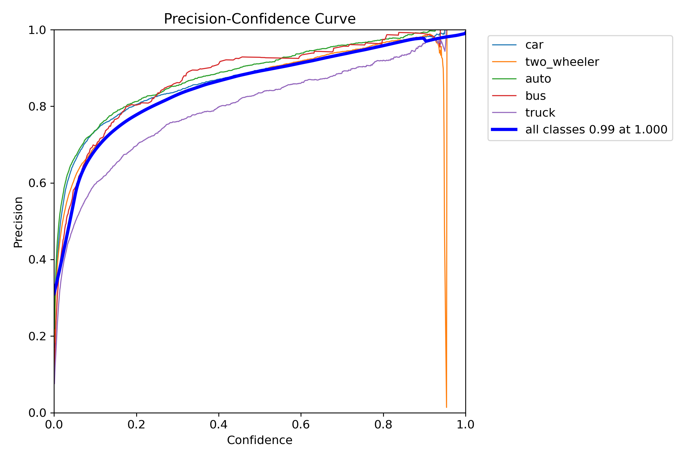
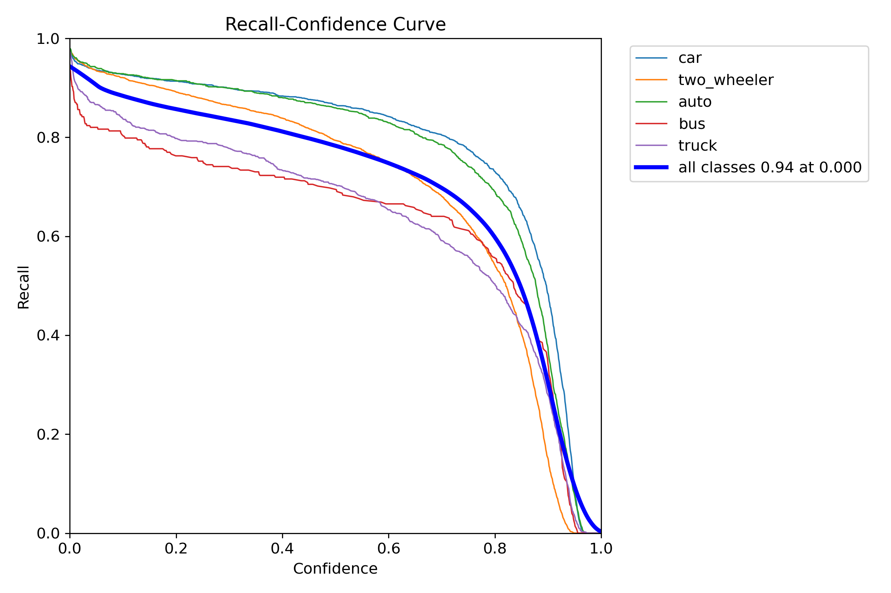
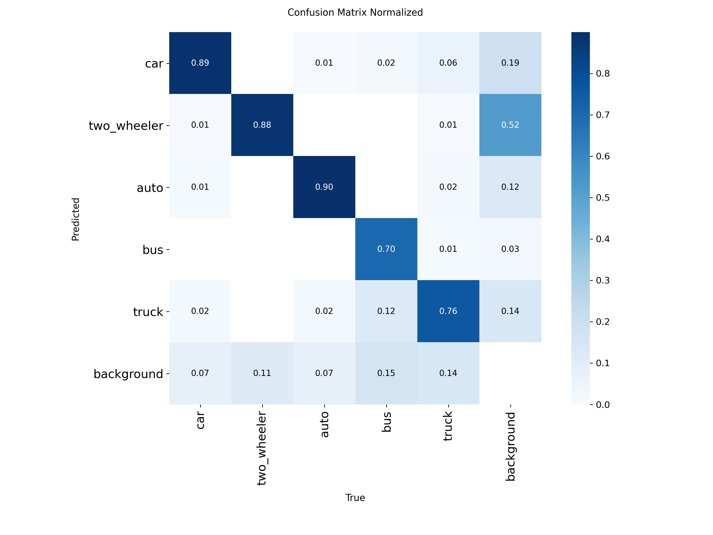
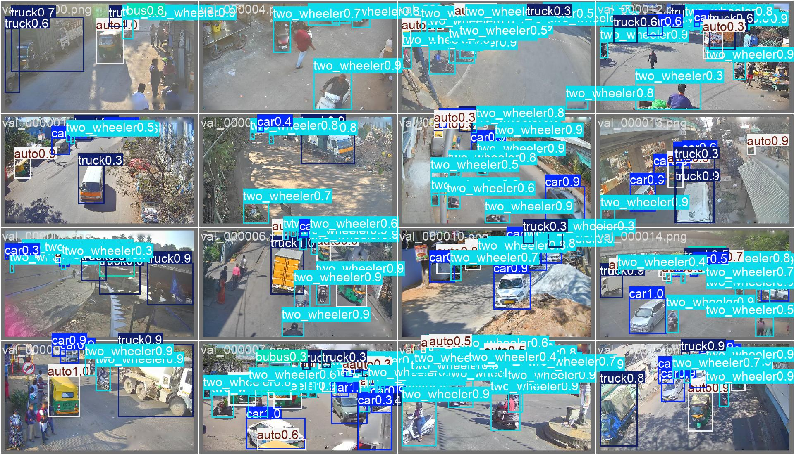

# Vehicle & Road-User Detection
**Model file:** `drishti/models/vehicle_uvh26_coarse_yolo11m_best.pt` · **Architecture:** YOLO11m · **Epochs:** 67

**Why this model:** The foundation layer (Task 2). Localises every road user so the rules engine knows which violation can apply (helmet→2-wheeler, seatbelt→car), selects the correct fine tier, and powers the emergency-vehicle exemption.

**Dataset:** UVH-26 — 26k Indian Safe-City CCTV images (coarse classes)
**Classes:** two-wheeler, auto-rickshaw, car, LCV, bus, truck, person, emergency-vehicle …

## Final validation metrics
| mAP@0.5 | mAP@0.5:0.95 | Precision | Recall |
|--------:|-------------:|----------:|-------:|
| **0.868** | 0.729 | 0.856 | 0.806 |

### Training graphs
| | |
|---|---|
|  Training curves (loss, P, R, mAP over epochs) |  F1–confidence curve |
|  Precision–Recall curve |  Precision–confidence |
|  Recall–confidence |  Normalised confusion matrix |

### Sample predictions on the validation set

