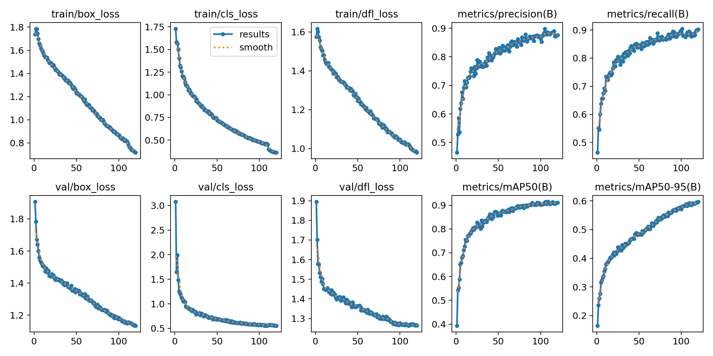
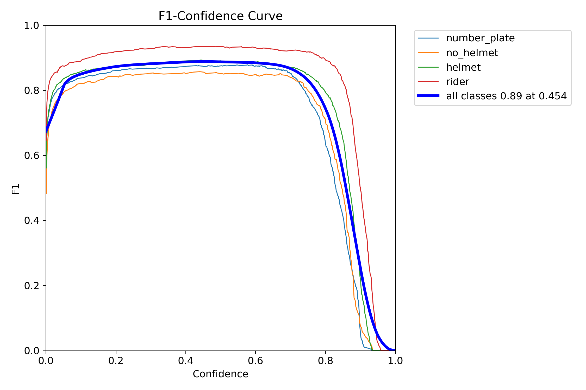
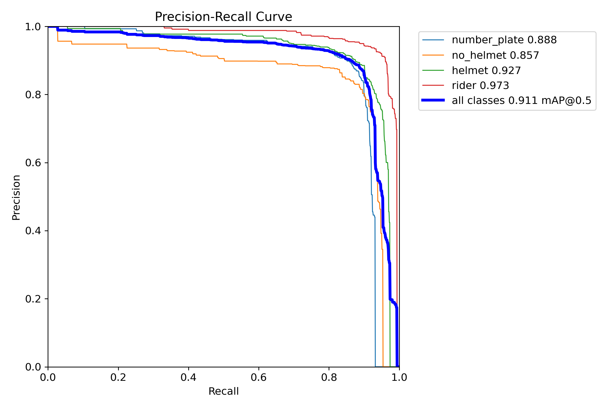
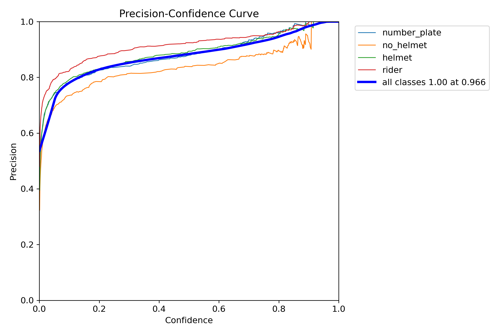
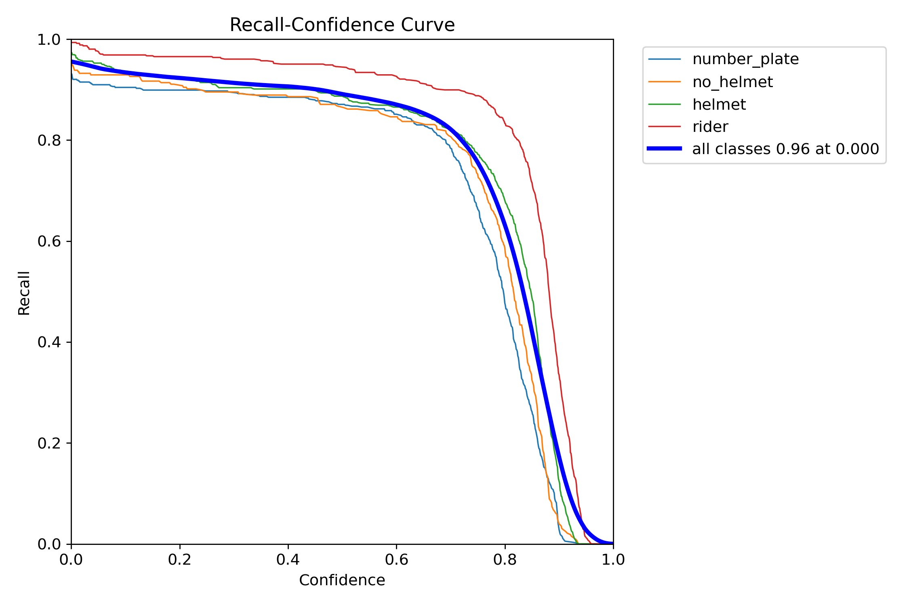
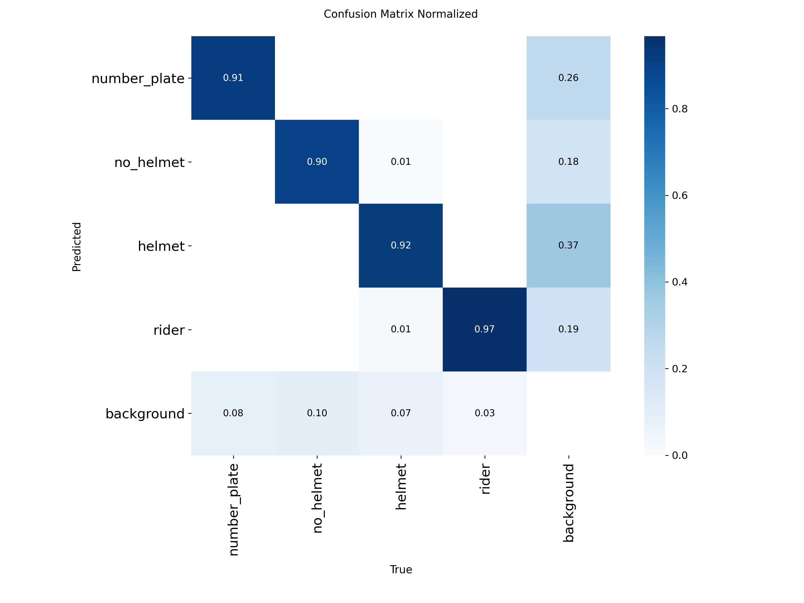
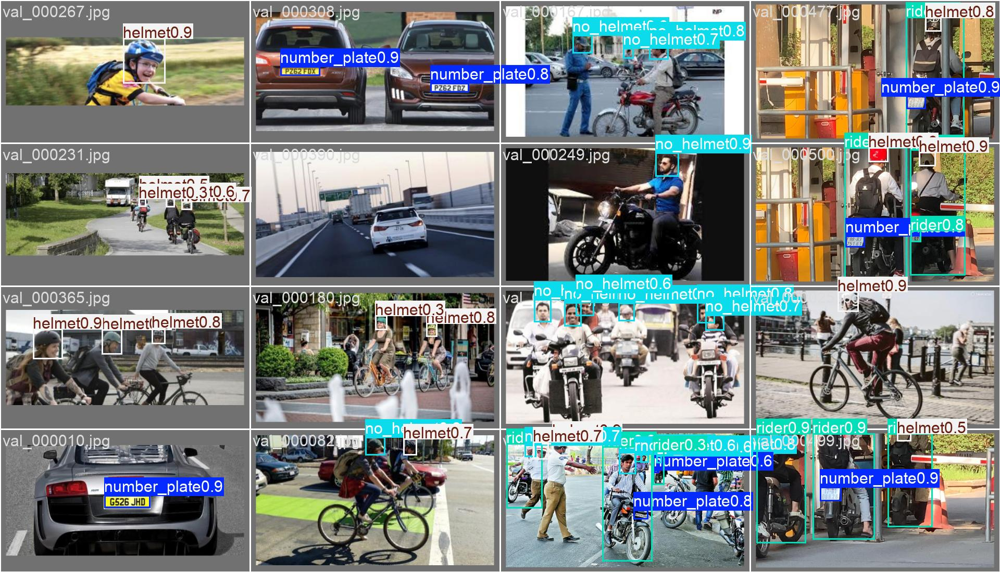

# Helmet / No-Helmet Detection
**Model file:** `drishti/models/helmet_merged_yolo11m_best.pt` · **Architecture:** YOLO11m · **Epochs:** 120

**Why this model:** Flags no-helmet (rider & pillion) and feeds triple-riding logic (≥3 persons on one two-wheeler).

**Dataset:** Indian Helmet + RideSafe-400 (merged)
**Classes:** rider, helmet, no-helmet, number-plate

## Final validation metrics
| mAP@0.5 | mAP@0.5:0.95 | Precision | Recall |
|--------:|-------------:|----------:|-------:|
| **0.911** | 0.597 | 0.876 | 0.902 |

### Training graphs
| | |
|---|---|
|  Training curves (loss, P, R, mAP over epochs) |  F1–confidence curve |
|  Precision–Recall curve |  Precision–confidence |
|  Recall–confidence |  Normalised confusion matrix |

### Sample predictions on the validation set

