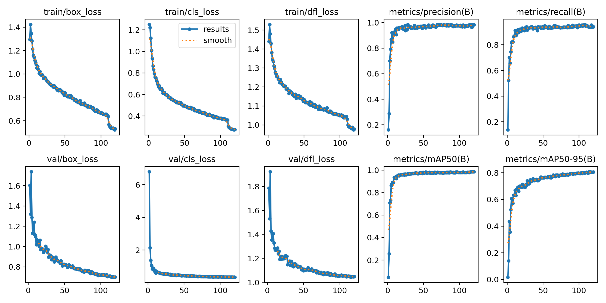
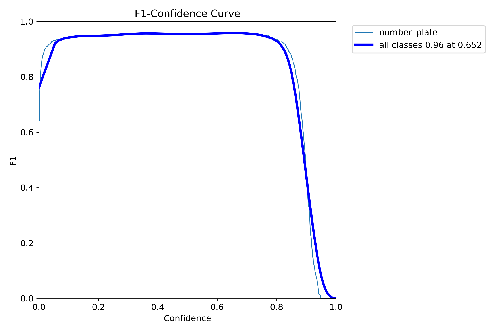
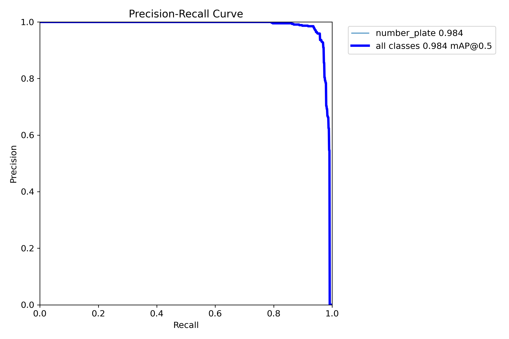
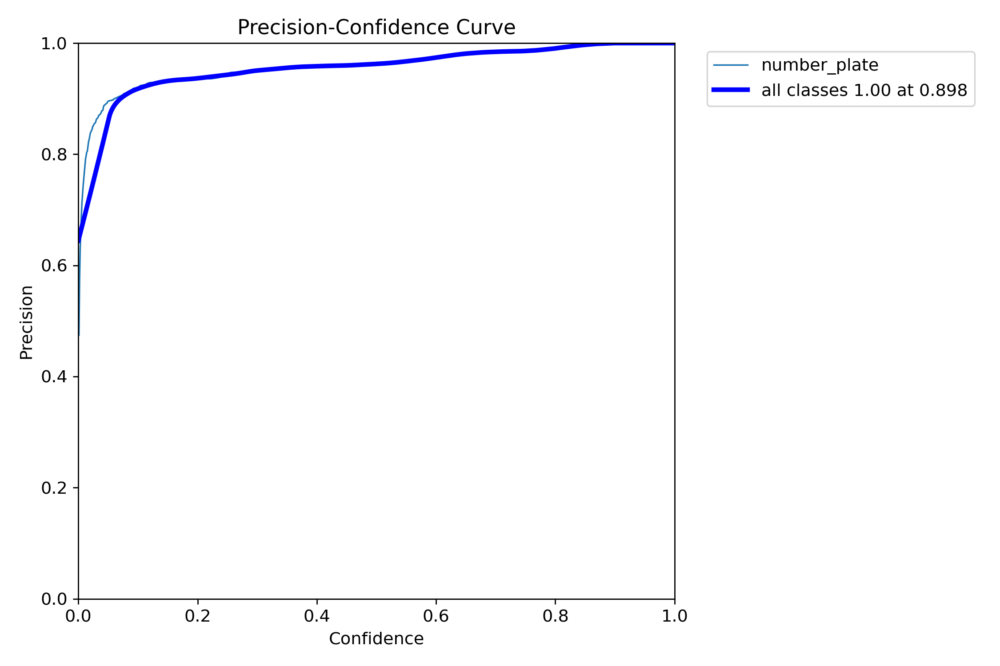
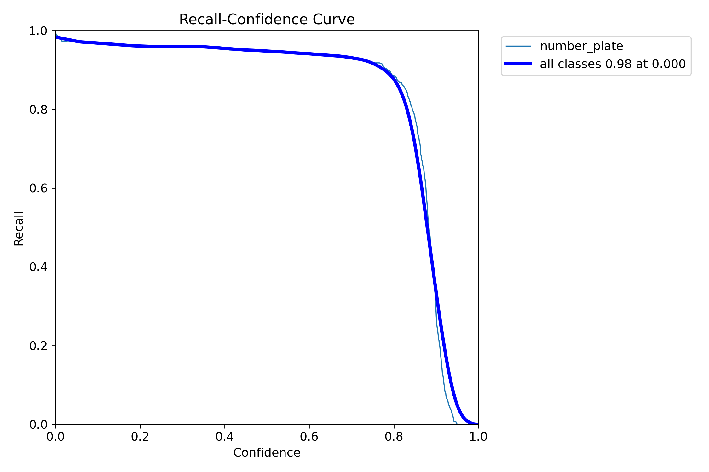
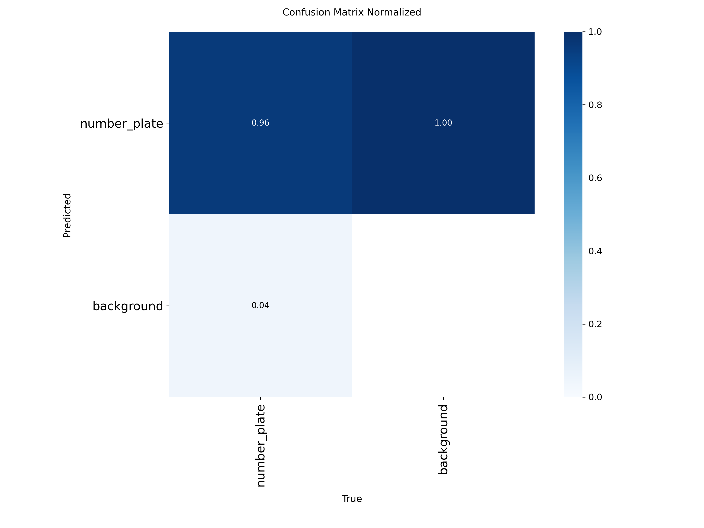
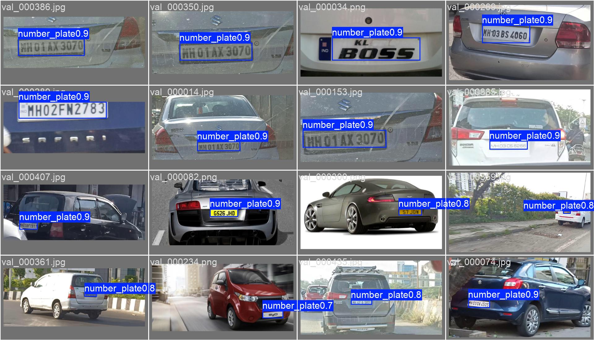

# Number-Plate Detection
**Model file:** `drishti/models/plate_merged_yolo11m_best.pt` · **Architecture:** YOLO11m · **Epochs:** 120

**Why this model:** Locates the offending vehicle's plate; the crop is passed to PaddleOCR for HSRP text → VAHAN lookup.

**Dataset:** Indian_LPR + CCPD (merged)
**Classes:** number-plate

## Final validation metrics
| mAP@0.5 | mAP@0.5:0.95 | Precision | Recall |
|--------:|-------------:|----------:|-------:|
| **0.985** | 0.807 | 0.984 | 0.940 |

### Training graphs
| | |
|---|---|
|  Training curves (loss, P, R, mAP over epochs) |  F1–confidence curve |
|  Precision–Recall curve |  Precision–confidence |
|  Recall–confidence |  Normalised confusion matrix |

### Sample predictions on the validation set

