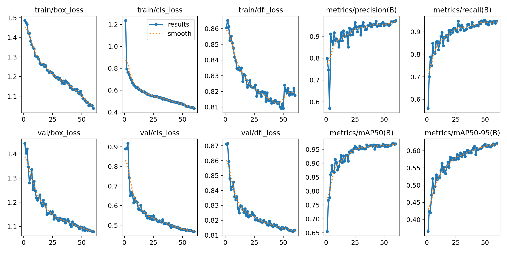
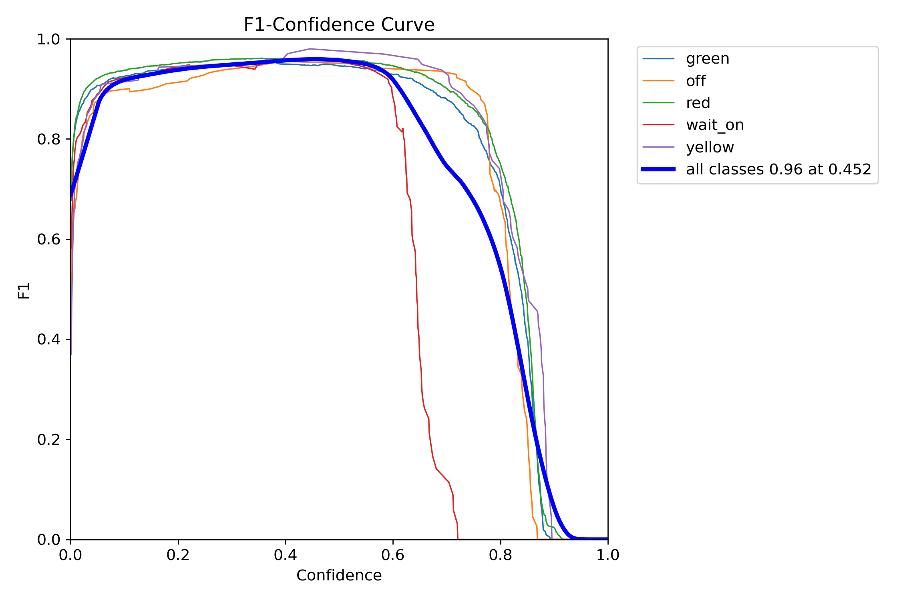
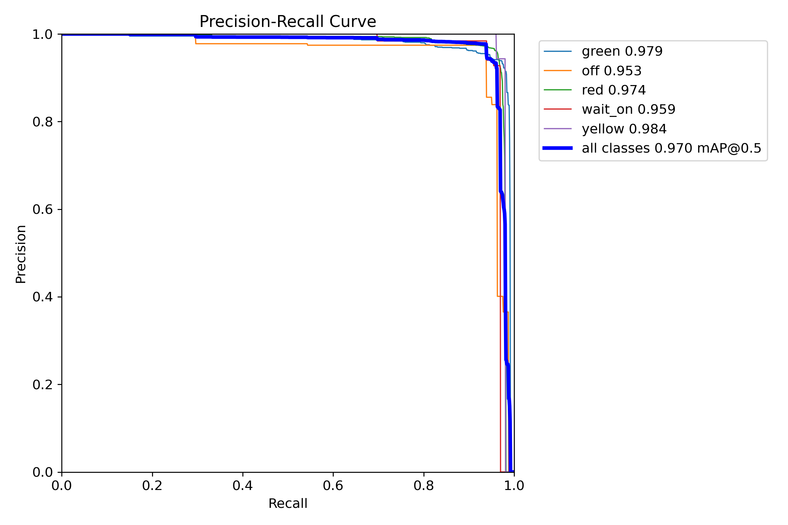
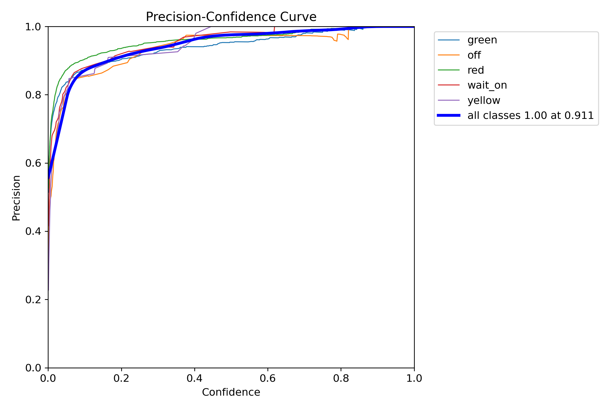
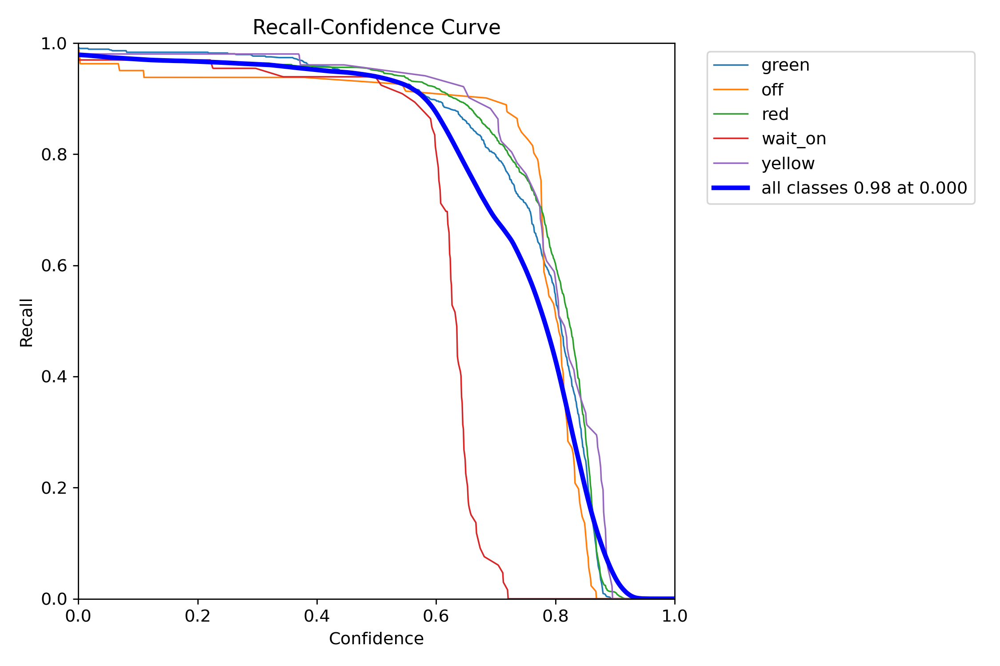
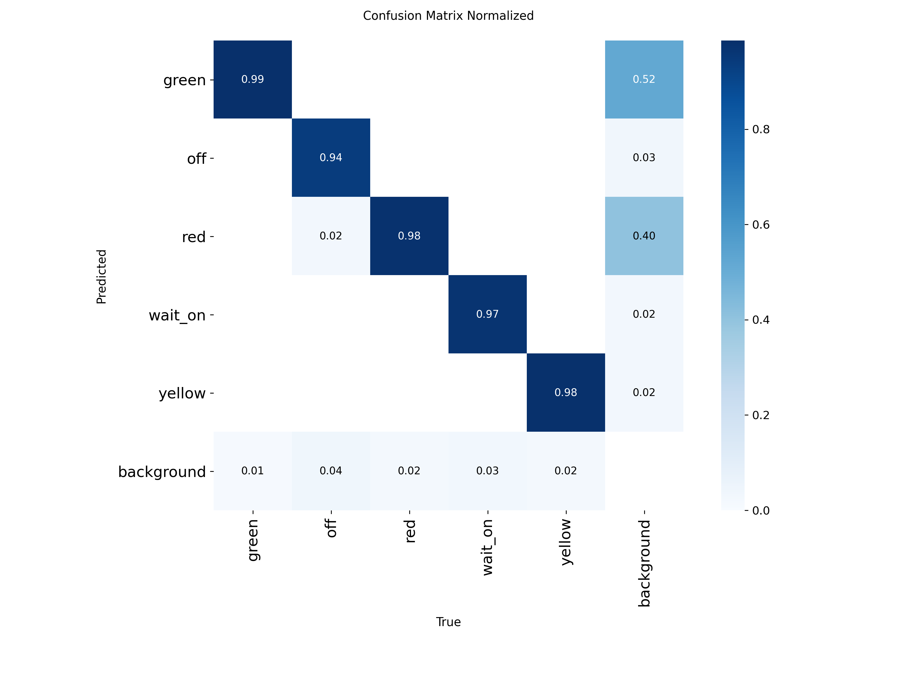
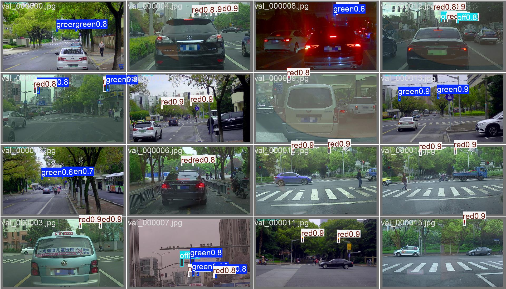

# Traffic-Light State
**Model file:** `drishti/models/trafficlight_s2tld_yolo11m_best.pt` · **Architecture:** YOLO11m · **Epochs:** 60

**Why this model:** Provides signal state for red-light-jump and stop-line violations.

**Dataset:** S2TLD — 5,786 images / 14,130 instances
**Classes:** red, yellow, green, off, wait-on

## Final validation metrics
| mAP@0.5 | mAP@0.5:0.95 | Precision | Recall |
|--------:|-------------:|----------:|-------:|
| **0.970** | 0.621 | 0.973 | 0.948 |

### Training graphs
| | |
|---|---|
|  Training curves (loss, P, R, mAP over epochs) |  F1–confidence curve |
|  Precision–Recall curve |  Precision–confidence |
|  Recall–confidence |  Normalised confusion matrix |

### Sample predictions on the validation set

