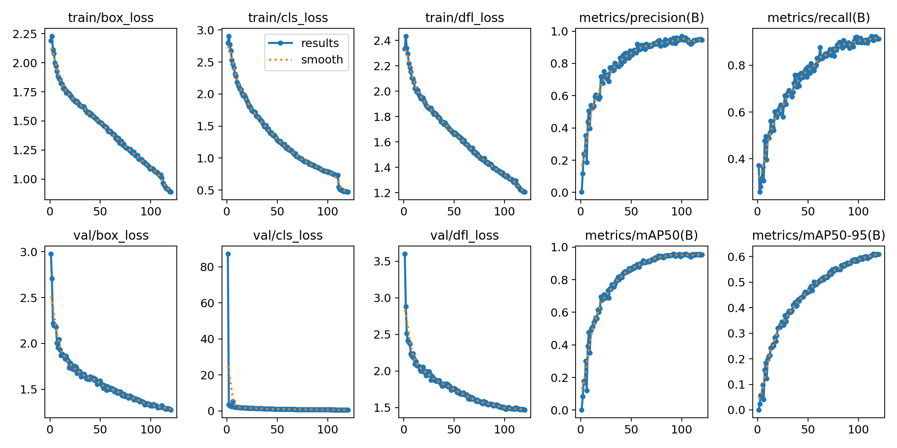
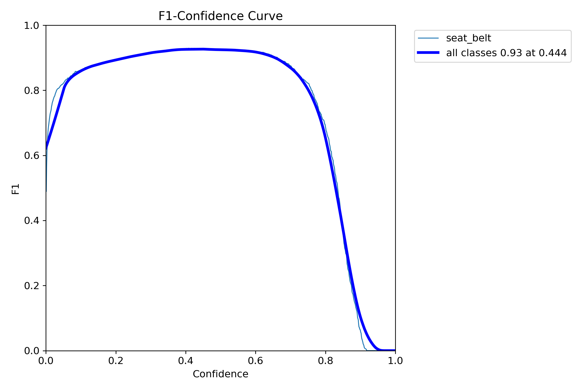
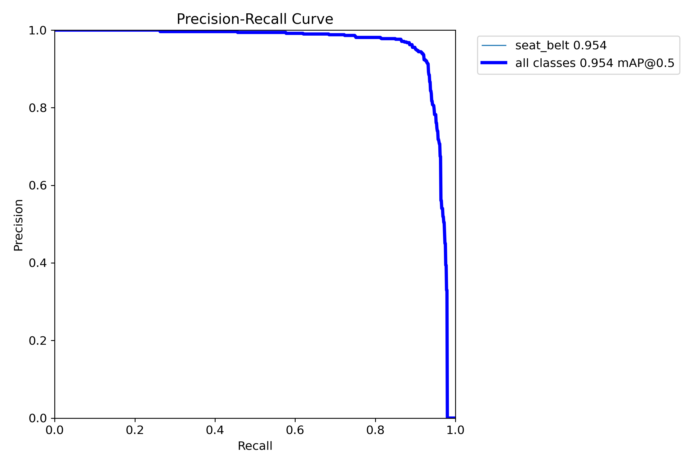
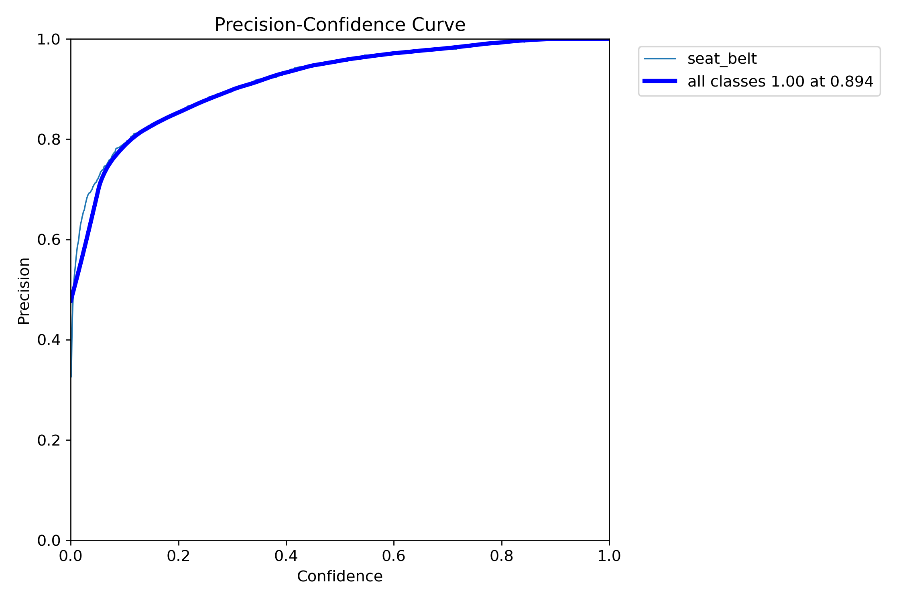
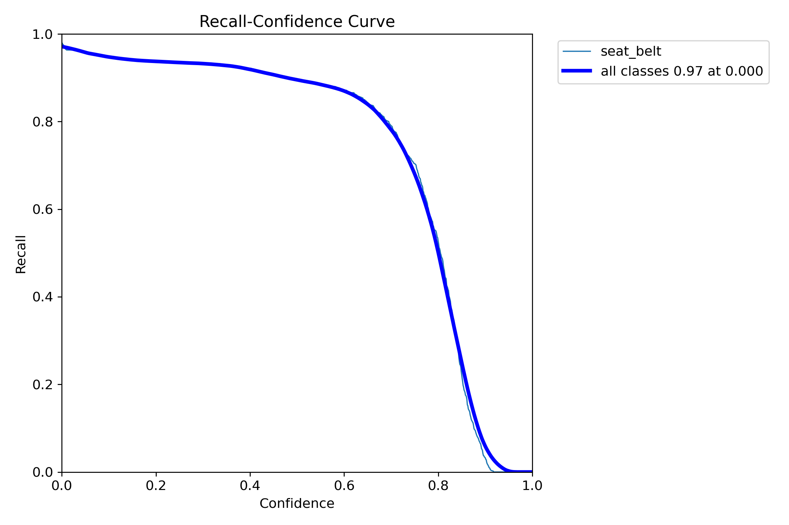
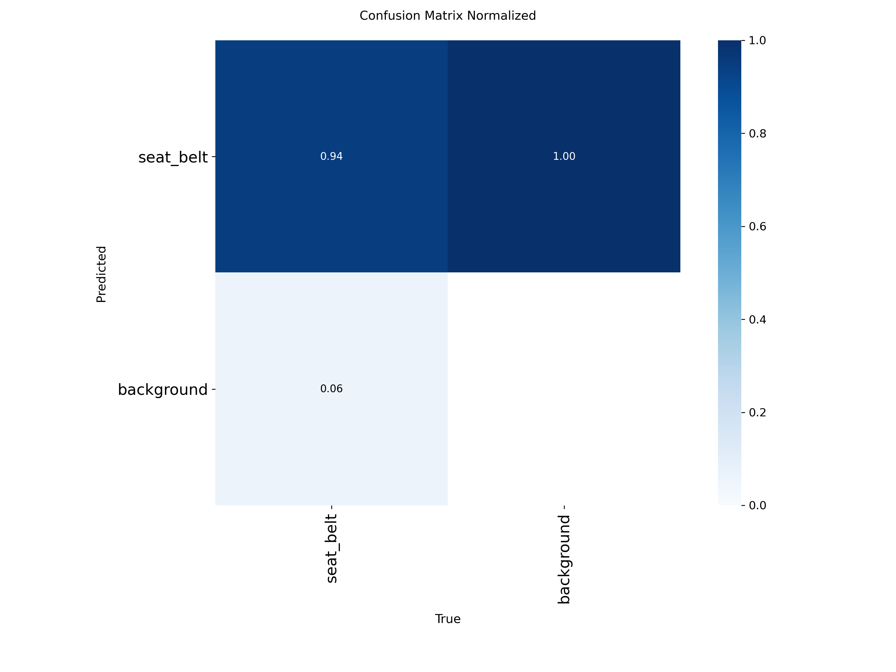
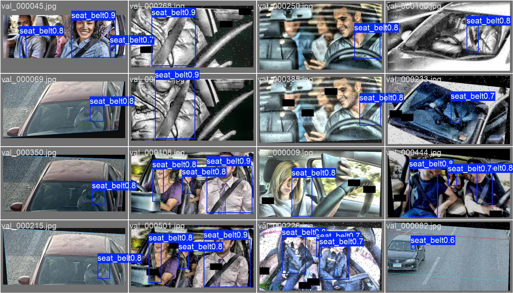

# Seatbelt Detection
**Model file:** `drishti/models/seatbelt_merged_yolo11m_best.pt` · **Architecture:** YOLO11m · **Epochs:** 120

**Why this model:** Flags no-seatbelt on the driver region; best-effort, reliable on clear front-facing angles.

**Dataset:** Merged seatbelt set (front-facing windshield crops)
**Classes:** seatbelt, no-seatbelt

## Final validation metrics
| mAP@0.5 | mAP@0.5:0.95 | Precision | Recall |
|--------:|-------------:|----------:|-------:|
| **0.953** | 0.610 | 0.946 | 0.913 |

### Training graphs
| | |
|---|---|
|  Training curves (loss, P, R, mAP over epochs) |  F1–confidence curve |
|  Precision–Recall curve |  Precision–confidence |
|  Recall–confidence |  Normalised confusion matrix |

### Sample predictions on the validation set

