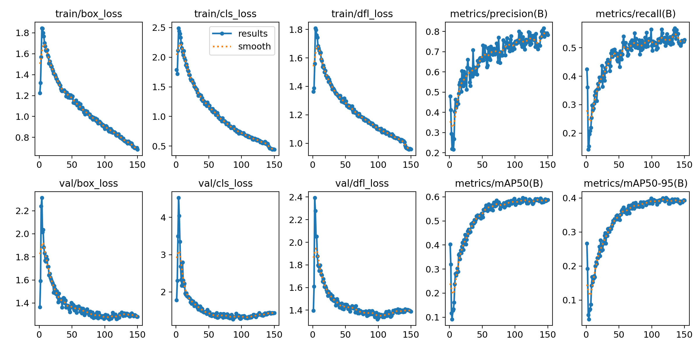
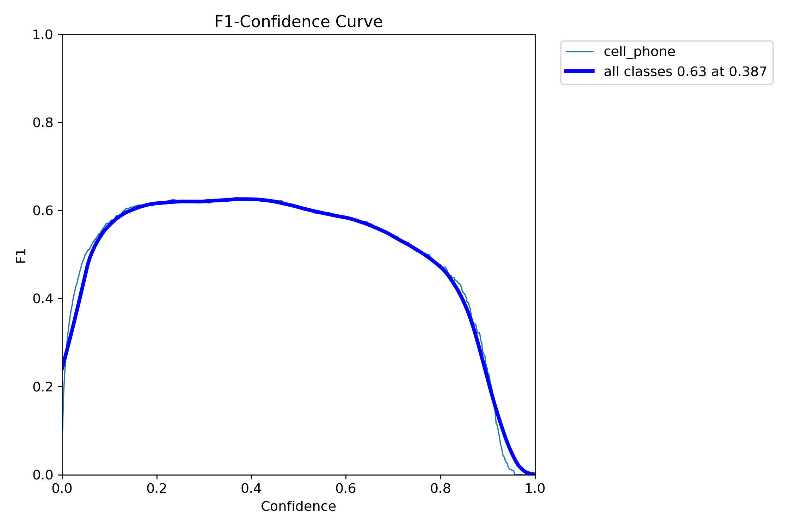
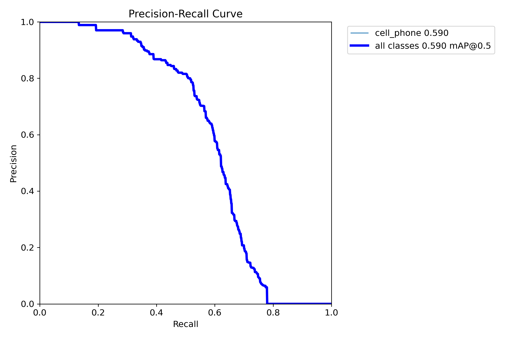
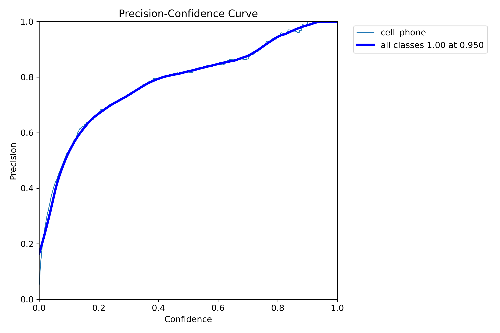
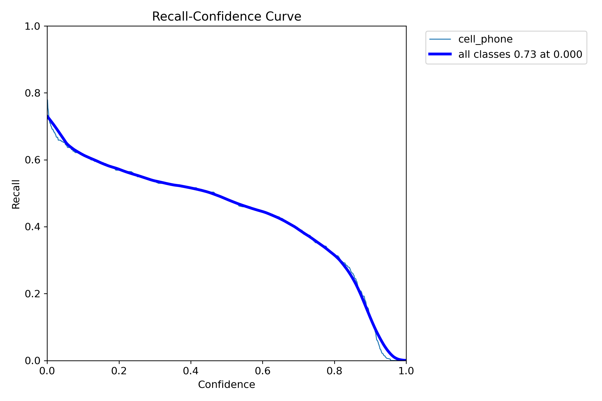
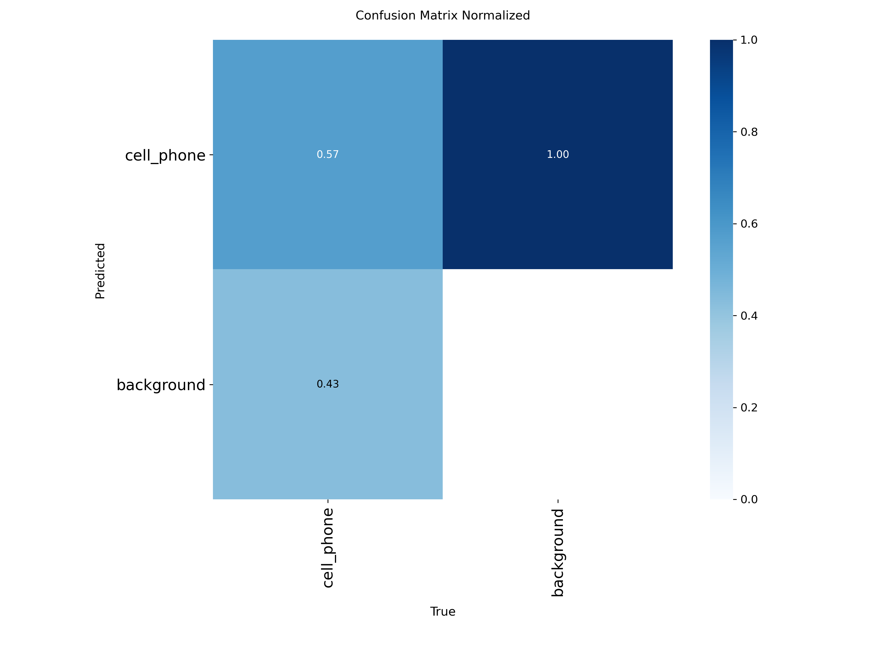
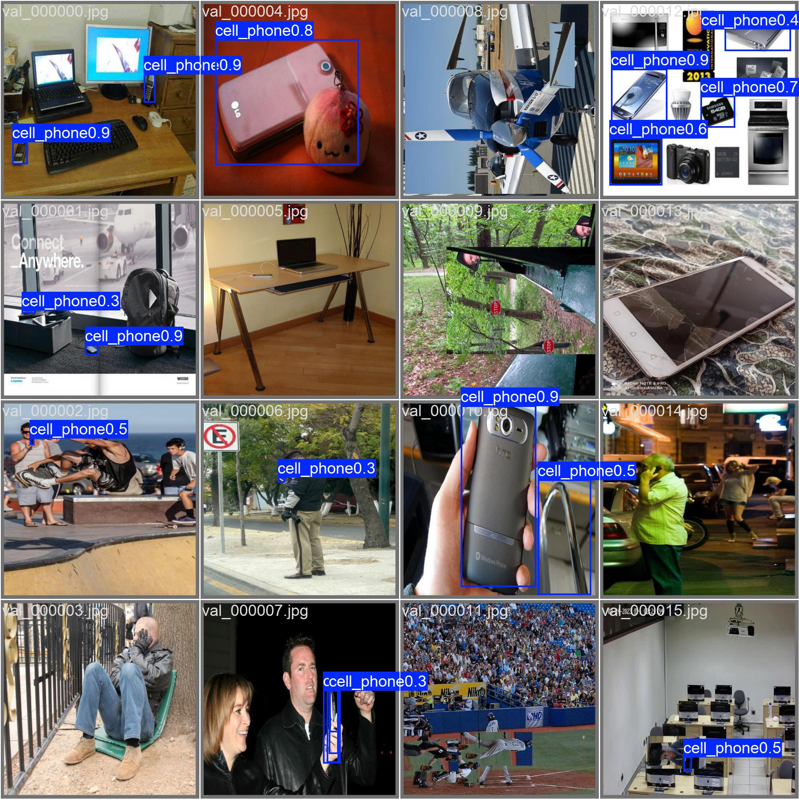

# Mobile-Phone-Use Detection
**Model file:** `drishti/models/phone_v2_yolo11m_best.pt` · **Architecture:** YOLO11m · **Epochs:** 150

**Why this model:** Flags handheld mobile-phone use while riding/driving. The hardest class (small object, occlusion) — lower recall, so low-confidence hits route to the officer Review Queue.

**Dataset:** Phone-use v2 (merged)
**Classes:** phone-use

## Final validation metrics
| mAP@0.5 | mAP@0.5:0.95 | Precision | Recall |
|--------:|-------------:|----------:|-------:|
| **0.588** | 0.393 | 0.783 | 0.528 |

### Training graphs
| | |
|---|---|
|  Training curves (loss, P, R, mAP over epochs) |  F1–confidence curve |
|  Precision–Recall curve |  Precision–confidence |
|  Recall–confidence |  Normalised confusion matrix |

### Sample predictions on the validation set

